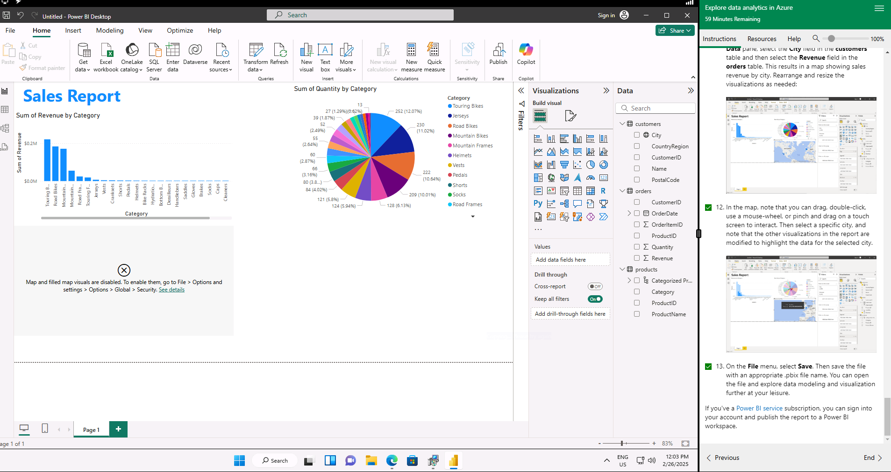

# Data Analytics in Azure

**Project Overview:**

In this project, I completed the Azure Skillable Labs, gaining hands-on experience in data analytics within the Azure ecosystem. Through a series of labs, I explored the capabilities of Azure for working with both relational and non-relational data, as well as its tools and features for conducting advanced data analytics. This project enhanced my skills in managing and analysing data in the cloud, particularly within Azure's powerful data analytics environment.
 
**Lab 1: Explore Relational Data in Azure**

**Lab 2: Explore Non-Relational Data in Azure**

**Lab 3: Explore Data Analytics in Azure**

**Skills Developed:** Throughout the completion of the Azure Skillable Labs, I developed key skills in cloud-based data management and analytics:
**Working with Relational Data:** I became proficient in managing structured data within Azure, including how to use Azure SQL Database for querying and managing relational datasets.

**Handling Non-Relational Data:** I gained experience in handling unstructured data, learning how to use Azure Cosmos DB and other NoSQL databases to work with flexible data models.

**Utilising Azure Analytics Tools:** I learned how to apply Azure’s powerful analytics services such as Azure Synapse Analytics and Azure Databricks to process, analyse, and generate insights from large-scale data.

**Cloud-Based Data Solutions:** I enhanced my understanding of the Azure cloud platform's data services and how they integrate to provide scalable, efficient, and secure solutions for data analytics.
 
**Conclusion:**
Completing the Azure Skillable Labs has significantly enhanced my skills in data analytics in the cloud, particularly within the Azure environment. I now have a solid understanding of working with both relational and non-relational data, and I am equipped with the knowledge to leverage Azure's advanced data analytics tools for large-scale data processing and analysis. This experience has prepared me to effectively manage and analyse data in cloud-based environments, providing valuable insights for decision-making.

**Data Source: Just IT**

**Full Project work book [here.](https://drive.google.com/file/d/1DYoDWbDC9-9cOobreAbX3gZ1cDrP6WpJ/view?usp=drive_link)**

**Click [here](https://github.com/Alamin-analyser/Data-Management-in-Azure) to see another Azure Project.**
